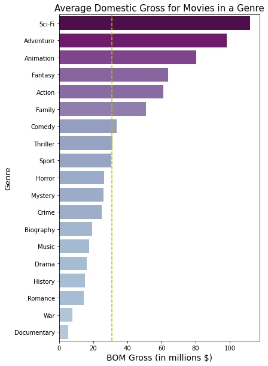
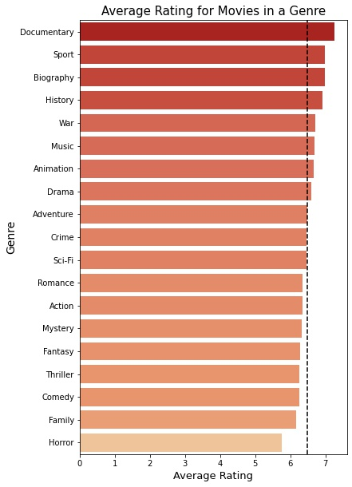
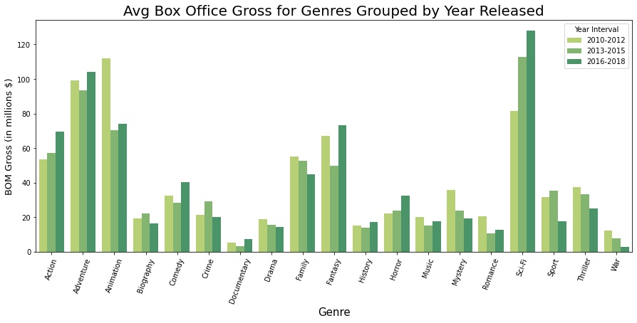

# Microsoft Movie Studio Project

**Author**: Jonny Hofmeister

## Overview

This project explores movie data from IMDB and Box Office Mojo to generate business insights for a new movie studio.

## Business Problem

Microsoft has decided to enter the movie production industry and create a new movie studio, but they want some advice. This project asks and analyzes which types of films are doing best at the box office, and the results will inform decisions and actions Microsoft's studio can take to create successful production company and films.

## Questions this analysis aims to answer:

- **Which genres in our data have the highest average domestic gross?**

- **Which genres have the highest average rating on IMDB**

- **How has the average gross of each genre changed over the recent years?**

***

## Data

Box Office Mojo (BOM) is a webside run by IMDB that reports and organizes box office receipts from Movies. The essential data being pulled from this source is a Domestic and Foreign Gross for correspoding movies identified by a title. 

IMDB is a webside containing extensive details about individual movies. The datasets contain information like titles, year released, runtime, production, persons involed (actors, diretors, etc), and importantly, review data associated with each movie. 

We are given access to more sets of data, but for simplicity and consistency, this analysis will focus on a dataset created from the combination of these two sources.

***

## Methods

This project uses methods to clean and join datasets, gaining more information for each row (movie) so that we can visualize different variables for the same set of movies. The IMDB data is cleaned into useful Genre columns, and the BOM data is matched with it using FuzzyWuzzys process.extract method. 

Methods for visualization are primarily bar charts as we are interested in viewing the categorical genre information for the movies. 

***

## Results and Visuals

### Finding Average Box Office Gross for Genres

- The top 5 grossing genres in descending order are Sci-Fi, Adventure, Animation, Fantasy, Action.

- Family, Comedy, Thriller, and Sport are all also at or above the average gross for movies.

****

### Using IMDB Ratings, find the highest rated genres

- The top rated genres on IMDB (for movies that are also contained in the BOM dataset) are Documentary, Sport, Biography, and History.

***

### Group Movies by the Year Released and examine Box Office Gross

- Sci-Fi's average gross has increased significantly since 2010. Animation has decreased in gross the most since 2010.

***

## Conclusions

From these results we can make conclusions and reccommendations to the stakeholders and people involved in creating Microsoft's new movie studio. 

1. To generate the most return in the box office from movie production investment, I reccommend Microsoft's new studio focus on creating movies in the top grossing genres, or at least ones above the box office gross average across all movies.

    - The top 5 genres are Sci-Fi, Adventure, Animation, Fantasy, and Action. Starting with movies in these genres will help to get to studio immediately turning profit and to help the studio achieve their first 'blockbuster', which will generate as much recognition for the studio as it will profit.
    
    - Family, Comedy, Thriller, and Sport movies are also more often than not above the average domestic gross for all movies and would be good choices for Microsoft studio productions.
    

2. Creating a well-recognized studio and turning profit does not just come from the box-office though. That is why I reccommend Microsoft's new studio focus some investment in creating movies/content that is rated highly by viewers. In our modern Netflix-era, production companies can generate revenue from films long after they air in theatre. The best ways they can do this are air them on TV or add them to streaming services. Ratings are a very important factor in determining if a user will select to watch that film, or if the film appears on the front page of the streaming service and is reccommended.

    - Documentary, Sportsd, Biography, and History are the highest rated genres on IMDB. Interestingly, these categories overlap often.
    
    - You may notice Doc and Bio are some of the lowest grossing genres in our data. This may not be a huge deal as nowdays, Documentaries are not often released in the theatre, but go straight to streaming services. In keeping up with popular trends in streaming, and in diversifying the new studios porfolio, I reccommend Mircosoft invest in creating content that will be have good ratings and be successful in the long run on modern-day viewing platforms. 
    
    
3. In examining how well each genre has done over recent years, it appears Sci-Fi has been growing in box office profit. I reccommend Mircosoft's studio follow these popular trends.

    - I reccommend Mircosoft go for a Sci-Fi movie as it is the highest grossing genre and has appears to also be the fastest growing. Superhero movies are a great example of modern popular Sci-Fi's and are among the top grossing films.
    
    - Black Panther is a superhero movie, and a Sci-Fi, and it the highest domestic gross in our data. It is also included in two of the other top grossing genres. I reccommend Mircosoft not just pick the top genre to create movies in, but to write movies that transcend the top few genres, appealing to more kinds of viewers and showing up in more categories on streaming services. 

***
### Next Steps

- Improve the size of our dataset by finding and including movies newer than 2018. 

- Looking at foreign gross profits compared to domestic, and make a reccommendation to the studio if they should release films and focus on markets internationally.

- Findng data from streaming serivces like Netflix, to find how a new production studio may best profit in a modern movie streaming market. Perhaps even by creating/buying Mircosofts own content streaming platform.

***
## For More Information

See the full analysis in the [Jupyter Notebook](./movie_analysis.ipynb).
